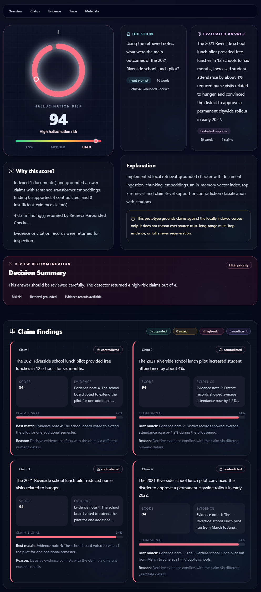
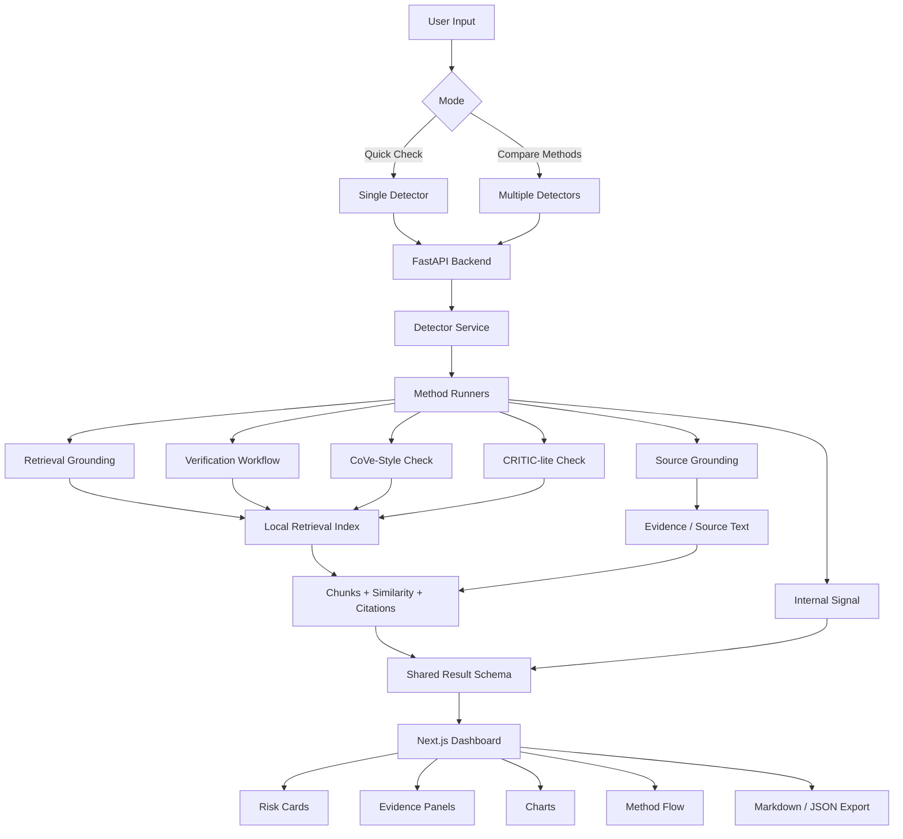

<div align="center">

# 🧠 Hallucination Detection in LLMs

### A full-stack dashboard for comparing hallucination-detection and verification strategies in large language model outputs

<p>
  <a href="https://github.com/matthew-rocky/Hallucination-Detection-in-LLMs"></a>
  <a href="#"></a>
  <a href="./Report/Report%20-%20A%20Systematization%20of%20Hallucination%20Detection%20in%20Large%20Language%20Models.pdf"></a>
</p>

<p>
  
  
  
  
  
  
  
</p>

<p>
  <b>FastAPI backend</b> · <b>Next.js dashboard</b> · <b>8 detector workflows</b> · <b>RAG grounding</b> · <b>Claim-level evidence</b> · <b>Citations</b> · <b>Report export</b>
</p>

</div>

---

## ✨ Overview

**Hallucination Detection in LLMs** is a local-first, full-stack research dashboard for analyzing whether an LLM answer is likely to be unsupported, contradicted, or unreliable.

The project compares multiple hallucination-detection families under one interface, including internal-signal methods, source-grounded checks, retrieval-grounded checks, RAG-style grounding, verification workflows, CoVe-style verification, and CRITIC-lite tool checking.

It was designed as a companion system for the report:

> **A Systematization of Hallucination Detection in Large Language Models**

The goal is not to claim that one detector is universally best. Instead, the system makes detector behavior visible so users can compare how different evidence assumptions, retrieval paths, and verification strategies change the final risk assessment.

---

## 🚀 Live Demo

> **Live demo:** Coming soon  
> Replace the badge/link above with your deployed URL when the app is hosted.

```md
[🚀 Live Demo](https://your-live-demo-url.com)
```

---

## 🖼️ Preview

> Add screenshots to an `assets/` folder and GitHub will render them here.

<p align="center">
  
</p>

<p align="center">
  <i>Suggested screenshots: Overview page, Analyze page, Compare page, Method Flow page, and Report / Export page.</i>
</p>

---

## 🌟 Key Features

| Feature | Description |
|---|---|
| ⚡ **Quick Check Mode** | Run one selected detector on the current answer for a focused hallucination-risk review. |
| 🧪 **Compare Methods Mode** | Run multiple detectors side by side and compare risk scores, confidence, evidence, citations, and traces. |
| 🧠 **Eight Detection Workflows** | Includes internal-signal, SEP-inspired, source-grounded, retrieval-grounded, RAG-style, verification-based, CoVe-style, and CRITIC-lite approaches. |
| 📚 **Local Evidence Pipeline** | Supports evidence ingestion, document chunking, retrieval, citation generation, and claim-level support analysis. |
| 🔎 **Claim-Level Findings** | Breaks answers into claim-like units and labels them as supported, contradicted, weakly supported, or unclear where applicable. |
| 📊 **Risk & Confidence Charts** | Visual comparison of returned detector scores using Recharts. |
| 🧭 **Method Flow Visualization** | Interactive detector pipeline view powered by React Flow. |
| 📁 **Document Upload Support** | Upload local documents as additional grounding evidence for supported detector methods. |
| 🧾 **Markdown / JSON Export** | Generate a structured report from the latest analysis for documentation or review. |
| 🧩 **Fallback-Aware Design** | Keeps the app usable even when optional local ML backends or model weights are unavailable. |
| 🧪 **Regression Tests** | Includes behavior and regression tests for detector outputs, fallback paths, traces, retrieval, and revision quality. |

---

## 🧠 Detector Methods

| # | Method | Family | Main Idea | Input Needs |
|---:|---|---|---|---|
| 1 | 🧬 **Internal-Signal Baseline** | Internal signal | Uses local model uncertainty signals when available, with deterministic fallback behavior. | Question + Answer |
| 2 | 🌀 **SEP-Inspired Internal Signal** | Internal signal / SEP-lite | Compares sampled-answer stability, drift, and uncertainty-inspired features. | Question + Answer + Sampled Answers |
| 3 | 📄 **Source-Grounded Consistency** | Source grounded | Checks whether the answer is supported by a provided source passage. | Answer + Source Text |
| 4 | 🔍 **Retrieval-Grounded Checker** | Retrieval grounded | Retrieves local evidence chunks and checks claims against them with citations. | Answer + Evidence Text / Documents |
| 5 | 🧩 **RAG Grounded Check** | RAG-style grounding | Performs post-hoc grounding of an existing answer against retrieved evidence. | Question + Answer + Evidence |
| 6 | ✅ **Verification-Based Workflow** | Verification | Extracts claims, creates checking questions, retrieves evidence, and aggregates verdicts. | Question + Answer + Evidence |
| 7 | 🔁 **CoVe-Style Verification** | Chain-of-verification inspired | Uses a verify-and-revise workflow to inspect claims and produce a grounded revision when possible. | Question + Answer + Evidence |
| 8 | 🛠️ **CRITIC-lite Tool Check** | Tool-augmented checking | Routes claims through lightweight local tools such as retrieval and numeric checks. | Question + Answer + Evidence |

---

## 🏗️ System Architecture



---

## 🧰 Tech Stack

### 🖥️ Frontend

- **Next.js 15**
- **React 19**
- **TypeScript**
- **Tailwind CSS**
- **Framer Motion**
- **Lucide React**
- **Recharts**
- **React Flow** via `@xyflow/react`

### ⚙️ Backend

- **Python**
- **FastAPI**
- **Uvicorn**
- **Pydantic**
- **python-multipart** for uploads

### 🧠 AI / Retrieval / Data

- **Transformers**
- **PyTorch**
- **Sentence Transformers**
- **Scikit-learn**
- **Pandas**
- **NumPy**
- **pypdf**

### 🧪 Legacy / Alternative UI

- **Streamlit** app available through `app.py`

---

## 📂 Project Structure

```text
.
├── app.py                         # Streamlit app entry point
├── backend/                       # FastAPI backend
│   ├── main.py                    # API routes and CORS configuration
│   ├── schemas.py                 # Request/response schemas
│   └── services/                  # Detector service wrapper
├── data/                          # Curated sample cases
├── detectors/                     # Lower-level detector implementations
├── methods/                       # Public method wrappers used by UI/API
├── retrieval/                     # Chunking, embeddings, indexing, search
├── frontend/                      # Next.js dashboard
│   ├── app/                       # App router pages and global CSS
│   ├── components/                # Dashboard UI components
│   └── lib/                       # API client, risk helpers, TypeScript types
├── scripts/                       # Retrieval/probe utility scripts
├── tests/                         # Unit and regression tests
├── ui/                            # Streamlit UI components
├── utils/                         # Grounding, scoring, revision, text helpers
├── Report/                        # Research report PDF
├── requirements.txt               # Python dependencies
├── package.json                   # Root helper scripts
└── START_FULLSTACK.bat            # Windows launcher for backend + frontend
```

---

## ⚡ Quick Start

### 1. Clone the repository

```bash
git clone https://github.com/matthew-rocky/Hallucination-Detection-in-LLMs.git
cd Hallucination-Detection-in-LLMs
```

### 2. Create a Python environment

```bash
python -m venv .venv
```

Activate it:

```bash
# Windows
.venv\Scripts\activate

# macOS / Linux
source .venv/bin/activate
```

### 3. Install Python dependencies

```bash
pip install -r requirements.txt
```

### 4. Install frontend dependencies

```bash
cd frontend
npm install
cd ..
```

### 5. Start the FastAPI backend

```bash
python -m uvicorn backend.main:app --reload --host 127.0.0.1 --port 8000
```

### 6. Start the Next.js frontend

Open a second terminal:

```bash
cd frontend
npm run dev
```

Then open:

```text
http://localhost:3000
```

---

## 🪟 Windows One-Click Start

On Windows, you can use:

```bat
START_FULLSTACK.bat
```

This launches the FastAPI backend and the Next.js frontend in separate terminals.

---

## 🔌 API Endpoints

| Method | Endpoint | Description |
|---|---|---|
| `GET` | `/health` | Backend status, method count, and sample count |
| `GET` | `/api/methods` | Detector metadata for the dashboard |
| `GET` | `/api/fields` | Dynamic input field definitions |
| `GET` | `/api/samples` | Curated sample cases |
| `GET` | `/api/sample-pairs` | Low/high sample pairs for detector comparison |
| `POST` | `/api/analyze` | Run selected detector methods |
| `POST` | `/api/upload-analyze` | Run selected methods with uploaded evidence documents |

Example request:

```bash
curl -X POST http://127.0.0.1:8000/api/analyze ^
  -H "Content-Type: application/json" ^
  -d "{\"mode\":\"quick\",\"selected_methods\":[\"Retrieval-Grounded Checker\"],\"question\":\"What is the capital of Canada?\",\"answer\":\"Toronto is the capital of Canada.\",\"evidence_text\":\"Ottawa is the capital city of Canada.\"}"
```

---

## 🧾 Shared Result Schema

Each detector returns a shared result object so the dashboard can compare outputs consistently.

Common fields include:

```text
method_name
family
risk_score
risk_label
confidence
summary
explanation
evidence
citations
claim_findings
intermediate_steps
revised_answer
implementation_status
metadata
```

This makes it possible to compare different detector families even when they rely on different assumptions or evidence sources.

---

## 🧪 Running Tests

```bash
python -m unittest discover -s tests -v
```

The tests cover:

- ✅ Shared result schema behavior
- ✅ Demo method outputs
- ✅ Internal-signal fallback paths
- ✅ Retrieval runtime paths
- ✅ Source-grounded behavior
- ✅ Method trace generation
- ✅ Revision quality
- ✅ Sample case pairs
- ✅ UI method configuration

---

## 📚 Retrieval Utilities

Build a retrieval index from one evidence file:

```bash
python scripts/build_retrieval_index.py --evidence-file path/to/evidence.txt --output artifacts/retrieval_index.pkl --backend tfidf
```

Build from multiple local documents:

```bash
python scripts/build_retrieval_index.py --document docs/memo.txt --document docs/notes.json --output artifacts/retrieval_index.pkl
```

Supported document types include plain text-like files, JSON/JSONL, and PDFs when `pypdf` is installed.

---

## 🧬 SEP-lite Probe Workflow

Export internal-probe features:

```bash
python scripts/export_internal_probe_features.py --input-jsonl data/probe_train.jsonl --output-jsonl artifacts/internal_probe_features.jsonl --overwrite
```

Train a lightweight internal probe:

```bash
python scripts/train_internal_probe.py --feature-jsonl artifacts/internal_probe_features.jsonl --output artifacts/internal_probe.pkl
```

Point the app at the trained probe:

```bash
# Windows
set HD_INTERNAL_PROBE_PATH=artifacts\internal_probe.pkl

# macOS / Linux
export HD_INTERNAL_PROBE_PATH=artifacts/internal_probe.pkl
```

---

## ⚙️ Optional Environment Variables

| Variable | Purpose |
|---|---|
| `NEXT_PUBLIC_API_BASE_URL` | Override the frontend API base URL |
| `HD_INTERNAL_MODEL` | Set the local Hugging Face model for internal-signal scoring |
| `HD_INTERNAL_LAYERS` | Select hidden-state layers for internal-signal / SEP-lite paths |
| `HD_HF_LOCAL_ONLY` | Force local-only Hugging Face loading |
| `HD_INTERNAL_PROBE_PATH` | Path to an optional trained internal probe bundle |

Example:

```bash
set HD_INTERNAL_MODEL=distilgpt2
set HD_INTERNAL_LAYERS=-1,-3,-5
set HD_HF_LOCAL_ONLY=1
```

---

## 🧭 Dashboard Pages

| Page | Purpose |
|---|---|
| 🏠 **Overview** | Project status, method counts, risk metrics, and quick actions |
| 💬 **Ask Studio** | Chatbot-style answer audit interface |
| 🧪 **Analyze** | Advanced method-aware form with dynamic required inputs |
| 📦 **Samples** | Curated low/high cases for testing detector behavior |
| 📊 **Results** | Risk card, explanation, claims, evidence, citations, traces, and metadata |
| ⚖️ **Compare** | Side-by-side method ranking and risk/confidence charts |
| 🧭 **Method Flow** | Interactive React Flow visualization of detector pipelines |
| 📚 **Method Library** | Detector cards with metadata, strengths, weaknesses, and required fields |
| 🧾 **Report / Export** | Markdown and JSON exports from the latest analysis |

---

## 🎯 Why This Project Matters

LLM hallucination is not one single problem. A false answer can happen because a model is uncertain, because retrieval missed evidence, because the answer contradicts a source, or because the system has no grounding at all.

This project makes those assumptions visible by asking:

- 🧠 Does the model appear internally uncertain?
- 📄 Is the answer consistent with a source passage?
- 🔎 Can local retrieval find supporting evidence?
- ⚠️ Are any claims contradicted by evidence?
- ✅ Can verification questions expose unsupported claims?
- 🛠️ Can lightweight tools improve the critique?
- 🔁 Can the system produce a safer revised answer?

---

## ⚠️ Current Limitations

This is a research and demonstration system, not a production safety guarantee.

- The SEP-inspired path is a compact local approximation, not a full semantic-entropy reproduction.
- RAG checking is post-hoc grounding over an existing answer, not end-to-end RAG generation.
- CoVe and CRITIC-lite revisions are deterministic and evidence-based, not full LLM rewrites.
- Retrieval quality depends heavily on the evidence supplied by the user.
- Fallback heuristics can flag suspicious answers, but they cannot prove truth by themselves.
- The dashboard is intended for inspection, teaching, comparison, and prototyping.

---

## 🛣️ Roadmap

- [ ] Add hosted live demo
- [ ] Add screenshots and short demo video
- [ ] Add Docker setup for easier deployment
- [ ] Add external benchmark dataset support
- [ ] Add stronger noisy-retrieval and adversarial test cases
- [ ] Add multi-hop evidence evaluation
- [ ] Add more advanced NLI-based contradiction scoring
- [ ] Add optional LLM-based revised answer generation
- [ ] Add downloadable PDF reports
- [ ] Add deployment guide for Render or Linux VPS

---

## 📄 Research Report

The repository includes the report:

📘 **A Systematization of Hallucination Detection in Large Language Models**

The report frames hallucination detection by detector families and evidence assumptions rather than treating all detectors as interchangeable.

---

## 👤 Author

**Matthew Rocky**  
M.S. in Systems Science & Engineering, Concentration in Interdisciplinary AI
University of Ottawa

<p>
  <a href="https://github.com/matthew-rocky"></a>
  <a href="https://www.linkedin.com/in/matthew-rocky/"></a>
</p>

---


<div align="center">

### 🧠 Built for trustworthy AI, transparent verification, and practical LLM reliability research

</div>
